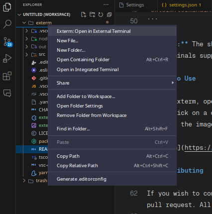

# Exterm

Exterm arose from the need to open the terminal and navigate through directories until finding the one I'm working on. It's a slow and tedious process, so I created Exterm to streamline this.

Exterm adds an item to the explorer/context menu of VS Code. When right-clicking on a directory, it opens the terminal directly in that directory.

## Installation

To install Exterm, you need to have [VS Code](https://code.visualstudio.com/) installed and follow the steps below:

1. Open VS Code.
2. Open the extensions menu (Ctrl+Shift+X).
3. Search for Exterm.
4. Click Install.
5. Check the configuration section to configure your preferred terminal.

## Requirements

By default, Exterm uses the terminal [wezterm](https://wezfurlong.org/wezterm/), but you can choose from the supported terminals below:

**Linux**

- [wezterm](https://wezfurlong.org/wezterm/)
- [gnome-terminal](https://help.gnome.org/users/gnome-terminal/stable/)
- [konsole](https://konsole.kde.org/)
- [xfce4-terminal](https://docs.xfce.org/apps/terminal/start)
- [alacritty](https://github.com/alacritty/alacritty)
- [kitty](https://github.com/kovidgoyal/kitty)
- [kermit](https://github.com/orhun/kermit)
- [rxvt-unicode](http://software.schmorp.de/pkg/rxvt-unicode.html)

**Windows**

- [cmd.exe (Windows)](https://docs.microsoft.com/en-us/windows-server/administration/windows-commands/cmd) (Not tested)

**MacOS**

## Configuration

To make Exterm open your preferred terminal, you need to configure it in the VS Code settings file. Follow the steps below:

1. Open the VS Code settings menu (Ctrl+Shift+P).
2. Search for "Preferences: Open Settings (JSON)".
3. Add the line below to the VS Code settings file, replacing the terminal with your preferred one:

```json
"exterm.terminalKind": "wezterm",
```

> **Note:** The shortcut **CTRL + Space** brings up an enum with all terminals supported by Exterm.

## How to Use

To use Exterm, open the explorer/context menu of VS Code, right-click on a directory, and click on "Open in terminal," as shown in the image below:



## Contributing

If you wish to contribute to Exterm, you can open an issue or a pull request. All help is welcome.

## Credits

- [Image by Freepik](https://www.freepik.com/free-vector/hand-drawn-owl-outline-illustration_22890206.htm#query=owl&position=7&from_view=keyword&track=sph&uuid=44968ab8-6880-4e9d-8c0e-700fe236349d)

## License

[MIT](LICENSE)
